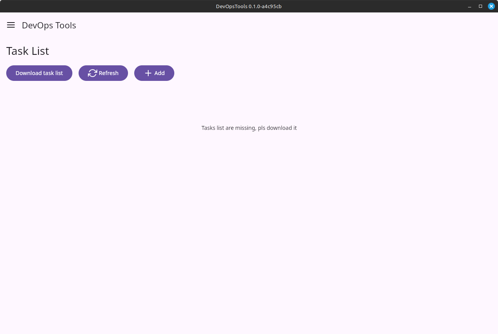
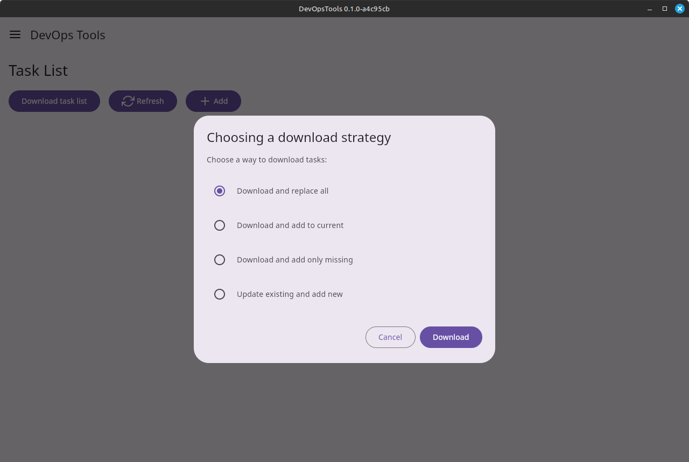
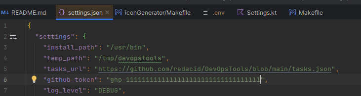
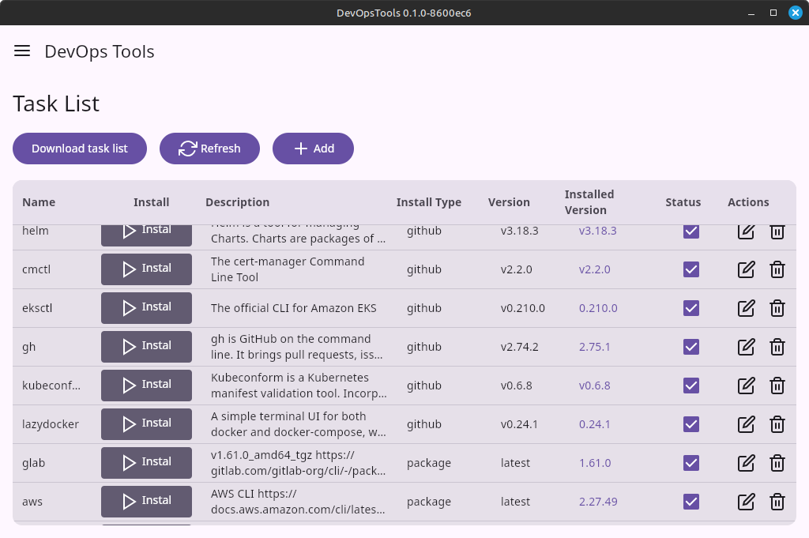
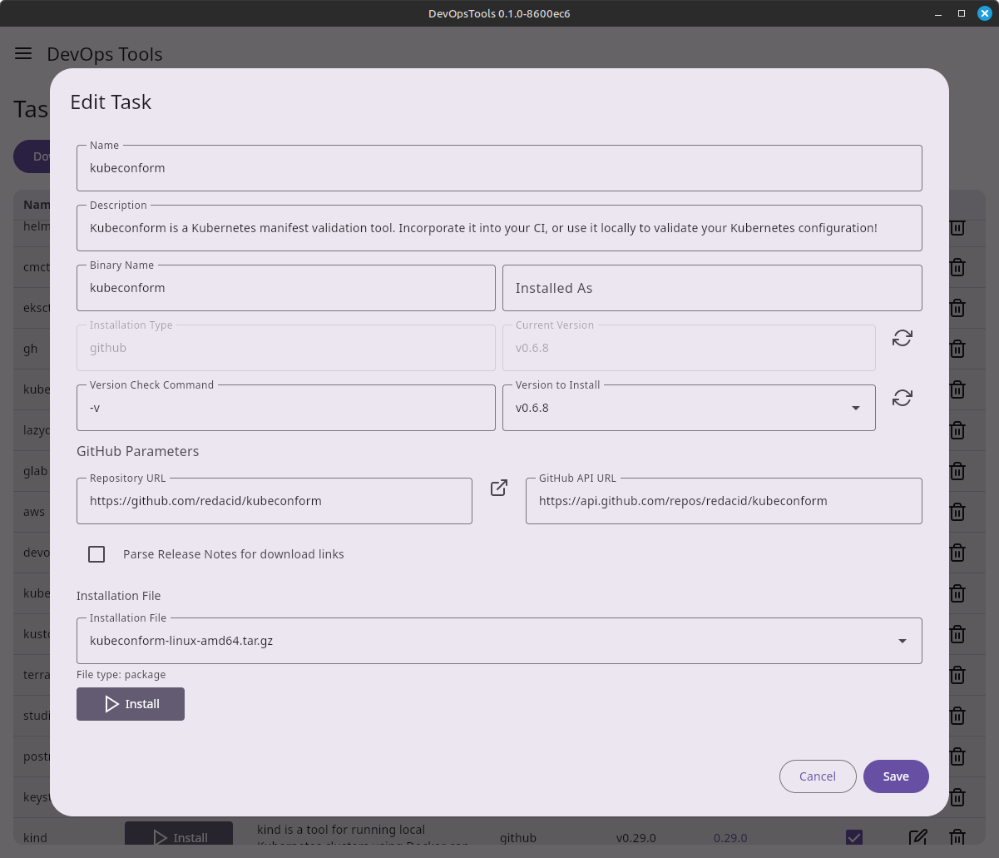
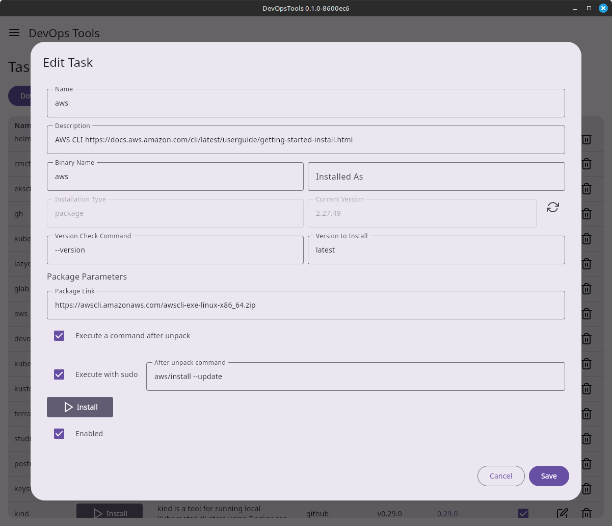
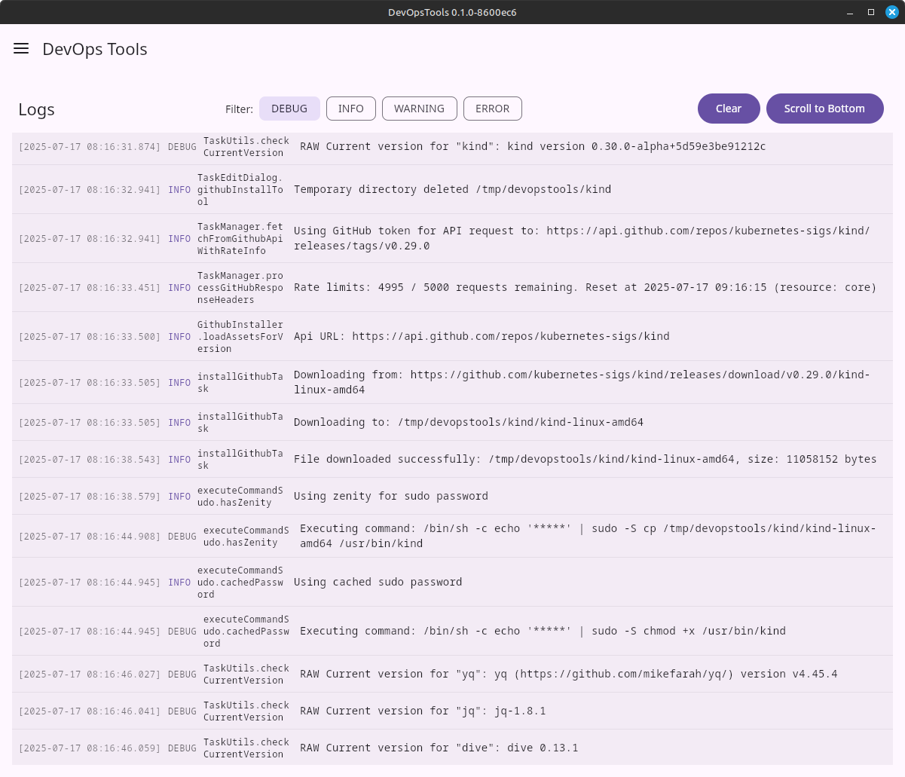

#  DevOps Tools GUI Installer

## First run


## Download tasklist


## After first run close application and edit settings
* add your github token, this need for increse github api requests limits, if keep it blank only 60 requests per hour allowed
* [https://docs.github.com/en/rest/using-the-rest-api/rate-limits-for-the-rest-api?apiVersion=2022-11-28](https://docs.github.com/en/rest/using-the-rest-api/rate-limits-for-the-rest-api?apiVersion=2022-11-28)
## Edit settings
```shell
vi ~/.devopstools/settings.json
```


## Main window


## Edit github installation type


## Edit package installation type


## Check logs


